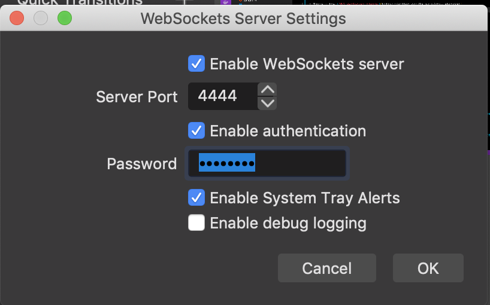
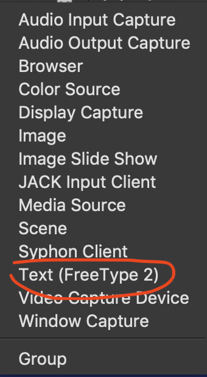
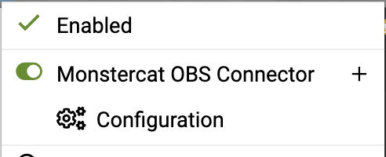
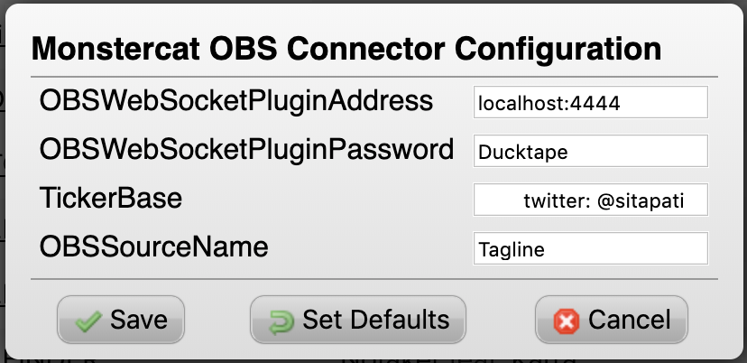
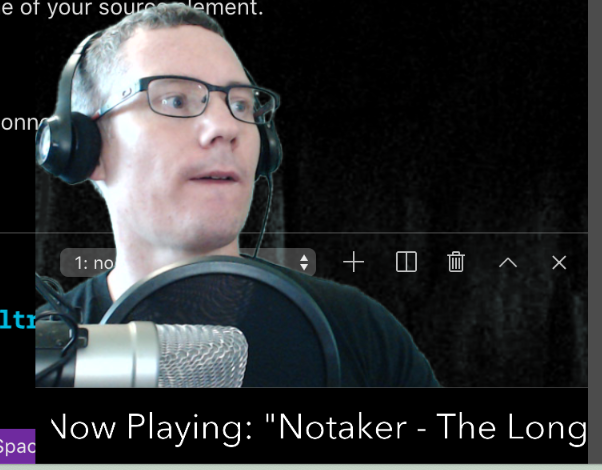

# Monstercat OBS Connector


[Monstercat](https://monstercat.com) is an awesome EDM publishing label that has a great relationsnip with gamers and streamers. For a very reasonable price you can stream Monstercat artists' music in your Twitch / YouTube streams with their [Monstercat Gold program](https://www.monstercat.com/gold).

[OBS (Open Broadcasting Software) Studio](https://obsproject.com/) is a popular streaming program.

Now you can add the name of the currently playing track from [Monstercat.com](https://monstercat.com) to a ticker in your OBS stream with this one simple hack!

This connector uses [Tampermonkey](https://www.tampermonkey.net/) to inject some JavaScript in the Monstercat.com player, and send the name of the currently playing track to OBS, so you can display in in your stream.

## To Use 

### OBS Setup

* Install the [OBS WebSocket plugin](https://github.com/Palakis/obs-websocket)
* Configure the password in OBS "Tools > WebSockets Server Plugin".


* Add a Source to your scene of Type "Text (FreeType 2)" (Make sure you note the name of your source for the configuration of the connector).

* Position it where you want it, and add a Filter with type "Scroll"

### Browser Setup

* Install the [Tampermonkey](https://www.tampermonkey.net/) plugin to your browser.
* Open the Tampermonkey settings in your browser.
* Click on "Utilities".
* Paste the following URL into the "Install from URL" text box:

```
https://raw.githubusercontent.com/jwulf/monstercat-obs-connector/master/tampermonkey.js
```

* Click "Install".
* Reload the Monstercat.com player in your browser.

You should now see a userscipt loaded on the Tampermonkey plugin.

* Click the Tampermonkey icon in the browser plugins section:



* Click on "Configuration"



* Enter the password you set for the OBS Web Socket Server plugin.
    - `TickerBase` is anything else you want in the scroller as well as the song details.
    - `OBSSourceName` is the name of your source element.

* Click "Save"
* Reload the page to establish the connection.
* Share the love!

